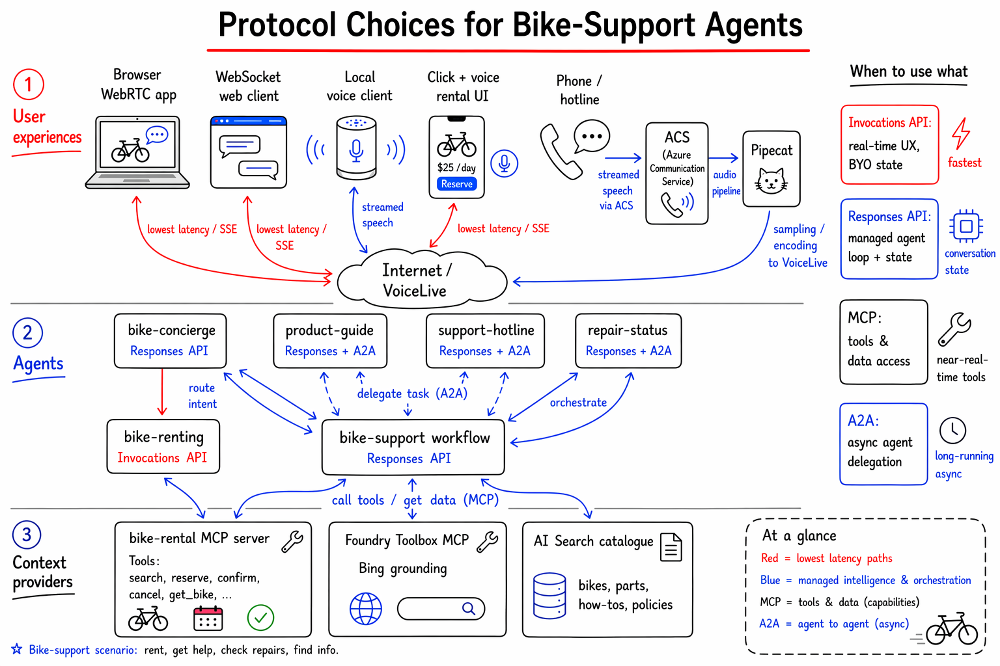

# Voice Product Support — CyclePro AI Bike Hotline

A voice-enabled product support hotline for bike recommendations, troubleshooting, and repair management, built on **Azure AI Foundry** hosted agents.

## Architecture

```
┌─────────────────────────────────────────────────────────────┐
│                    bike-support (Workflow)                    │
│         Routes conversations to the right specialist         │
└──────────┬──────────────┬──────────────────┬────────────────┘
           │              │                  │
  ┌────────▼────────┐     │                  │
  │  bike-concierge │     │                  │
  │  (Prompt Agent) │     │                  │
  └────────┬────────┘     │                  │
           │              │                  │
  ┌────────▼──────┐ ┌─────▼──────┐ ┌────────▼──────┐
  │ product-guide │ │  support-  │ │ repair-status │
  │ (Hosted Agent │ │  hotline   │ │ (Hosted Agent │
  │  AI Search)   │ │ (Hosted    │ │  LangGraph)   │
  └───────────────┘ │  Agent     │ └───────────────┘
                    │  Bing Web) │
                    └────────────┘
```

## Narrative



This project demonstrates the different options for protocol-based communication across an
agentic system. It focuses on **A2A**, **MCP**, **AG-UI**, **ACP**, the **Responses API** and
the **Invocations API**, and shows how they fit together across three layers:

1. **User experiences** — how humans reach the system: web apps, mobile clients, and phone /
   voice integrations.
2. **Agents** — the reasoning units, exposed via the Invocations API, the Responses API, or A2A.
3. **Context providers** — the tools and data sources agents draw on, surfaced via MCP
   (MCP servers and MCP-capable agents).

The same bike-support domain is wired up repeatedly through these different protocols so the
trade-offs between them become concrete rather than abstract.

### Layer 1 — User experiences

| Experience | Channel | Backend protocol | Where in the repo |
| --- | --- | --- | --- |
| Browser web app (WebRTC) | Low-latency audio + data channel | VoiceLive → hosted agent | [src/webrtclive](src/webrtclive), [src/webrtcpipecat](src/webrtcpipecat) |
| Browser web app (WS proxy) | Binary PCM + JSON over WebSocket | VoiceLive → hosted agent | [src/webclient](src/webclient) |
| Local voice client (mic/speaker) | VoiceLive STT/TTS | Responses / Invocations / MCP | [src/voice](src/voice), [src/voice-invocation](src/voice-invocation) |
| Click + voice rental UI | WebRTC + UI events | Invocations API (SSE) | [src/webrtc-bike-rental](src/webrtc-bike-rental) |
| Phone / hotline integration | Streamed spoken turns | VoiceLive → workflow agent | [src/workflows/bike-support.yaml](src/workflows/bike-support.yaml) |

### Layer 2 — Agents and their exposure protocols

| Agent | Type | Exposed via | Notes |
| --- | --- | --- | --- |
| `bike-concierge` | Prompt agent | Responses API | Intent classifier / router with structured JSON output |
| `product-guide` | Hosted (Agent Framework) | Responses API + A2A | AI Search–grounded catalogue answers |
| `support-hotline` | Hosted (Agent Framework) | Responses API + A2A | Bing-grounded troubleshooting via Foundry Toolbox **MCP** |
| `repair-status` | Hosted (LangGraph) | Responses API + A2A | Stateful repair scheduling tools |
| `bike-renting` | Hosted (Invocations) | **Invocations API** | Voice + click rental, custom UI/SSE events |
| `voice-live-mcp` | Local voice agent | VoiceLive + **MCP** | Self-contained local demo, no hosted agent |
| `bike-support` | Workflow | Responses API | Orchestrates the concierge + specialists |

### Layer 3 — Context providers (MCP)

| Provider | Kind | Tools exposed | Consumed by |
| --- | --- | --- | --- |
| `bike-rental` MCP server | Streamable-HTTP MCP server | `search_bikes`, `get_bike`, `reserve_bike`, `confirm_booking`, `cancel_reservation`, … | `voice-live-mcp`, any MCP client |
| Foundry Toolbox (Bing Custom Web Search) | Hosted MCP toolbox | Web search / grounding | `support-hotline` |

### Choosing a protocol: Invocations vs Responses vs MCP vs A2A

The four protocols are largely **orthogonal**, not competing — they differ mainly in *how much
the platform manages state and orchestration*, and in their latency and concurrency profiles.

- **Invocation API** — a raw, low-level endpoint optimised for performance and flexibility. The
  client or container fully controls state, orchestration, and async behaviour. Lowest latency,
  best for real-time voice / WebRTC pipelines and backend-controlled orchestration.
- **Responses API** — a higher-level abstraction with built-in agent loops, optional
  conversation state, and integrated tool execution. Simplifies development at the cost of
  slightly more overhead from managed orchestration. Ideal for most enterprise agents.
- **MCP** — a lightweight, mostly stateless request/response (with optional streaming) layer for
  synchronous or near-real-time access to external tools and data. Minimal overhead; used
  whenever agents need structured access to enterprise tools and data systems.
- **A2A** — designed for asynchronous, stateful collaboration *between agents*, where
  long-running tasks, delegation, and progress tracking are first-class. Highest latency envelope
  due to network hops and task-lifecycle management; used in multi-agent architectures that
  coordinate complex workflows or integrate across platforms.

| Dimension | Invocation API | Responses API | MCP | A2A |
| --- | --- | --- | --- | --- |
| Abstraction level | Raw / low-level | High-level agent loop | Tool-invocation layer | Agent collaboration layer |
| State management | Stateless (developer-managed) | Flexible / partially or fully managed | Not enforced (client/server-managed) | Stateful at the task level |
| Orchestration | Client/container controlled | Platform-managed agent loop | None (caller orchestrates) | Task delegation + lifecycle |
| Sync vs async | Sync + optional streaming | Sync + optional streaming | Sync + streaming, short-lived | Async, long-running, resumable |
| Latency profile | Lowest | Slightly higher | Minimal overhead | Highest envelope |
| Best for | Real-time UX, custom runtimes, backend orchestration | Most enterprise agents, built-in reasoning | Structured tool / data access | Multi-agent coordination & delegation |

**Sources:** [Manage hosted sessions (learn.microsoft.com)](https://learn.microsoft.com/en-us/azure/foundry/agents/how-to/manage-hosted-sessions) ·
[Migrate to Responses API (developers.openai.com)](https://developers.openai.com/api/docs/guides/migrate-to-responses) ·
[MCP vs A2A (stackone.com)](https://www.stackone.com/blog/mcp-vs-a2a-protocol/) ·
[A2A vs MCP — when to use which (stride.build)](https://www.stride.build/blog/agent-to-agent-a2a-vs-model-context-protocol-mcp-when-to-use-which) ·
[Invocations basic sample (github.com)](https://github.com/microsoft-foundry/foundry-samples/tree/main/samples/python/hosted-agents/agent-framework/invocations/01-basic) ·
[A2A streaming & async (a2a-protocol.org)](https://a2a-protocol.org/latest/topics/streaming-and-async/)


## Agents

### 1. `bike-concierge` — Prompt Agent
Intent classifier and router. Uses structured JSON output to route requests to the right specialist agent.

### 2. `product-guide` — Hosted Agent (Agent Framework)
Answers questions about bike models and helps customers compare city, mountain, and children's bikes.
Uses **Azure AI Search** (vector database) to search the bike catalogue.

### 3. `support-hotline` — Hosted Agent (Agent Framework + Bing)
Troubleshoots bike problems with internet-grounded answers. Uses the **Foundry Toolbox MCP** with
Bing Custom Web Search to find repair guides and maintenance tips.

### 4. `repair-status` — Hosted Agent (LangGraph)
Handles repair scheduling and status queries. Built with **LangGraph** and backed by in-memory
repair job data. Tools:
- `get_repair_status` — look up a job by ID
- `list_repair_jobs_for_customer` — search jobs by customer name
- `schedule_repair` — book a new appointment
- `cancel_repair` — cancel an existing booking
- `get_available_slots` — find open appointment slots

### 5. `bike-support` — Workflow Agent
Top-level entry point that orchestrates the concierge and specialist agents.
Defined in [src/workflows/bike-support.yaml](src/workflows/bike-support.yaml).

### 6. `bike-renting` — Hosted Agent (Invocations Protocol)
Voice + click rental flow built on `azure-ai-agentserver-invocations`. The agent
helps customers browse the rental fleet, pick a bike, reserve it for 30 minutes,
and confirm a multi-day booking. Conversation state machine:
`idle → results_shown → bike_selected → reserved → booked`.

Designed for the **Voice Live SDK multi-modal scenario** — Voice Live streams
spoken turns and UI click events into the same `/invocations` endpoint, and the
agent emits both spoken text deltas and custom UI events (cards, reservations)
back over SSE. See [src/agents/bike-renting/main.py](src/agents/bike-renting/main.py)
and [agent.manifest.yaml](src/agents/bike-renting/agent.manifest.yaml).

### 7. `voice-live-mcp` — Local Voice Agent (VoiceLive + MCP)
Standalone voice agent that uses the Azure VoiceLive SDK directly (speech-in /
speech-out from the local microphone and speakers) and delegates tool calls to
the bike-rental **MCP server** (`src/mcp-server-bike-rental/server.py`). Useful
as a self-contained local demo of VoiceLive + MCP without any hosted Foundry
agent in the loop. See [src/agents/voice-live-mcp/README.md](src/agents/voice-live-mcp/README.md).

### Supporting backend: `bike-rental` MCP Server
Streamable-HTTP MCP server in [src/mcp-server-bike-rental/server.py](src/mcp-server-bike-rental/server.py)
that exposes the rental fleet as MCP tools (`search_bikes`, `get_bike`,
`reserve_bike`, `confirm_booking`, `cancel_reservation`, …). Consumed by the
`voice-live-mcp` agent and any other MCP-compatible client.

## Scenarios

The repo ships several **end-to-end voice scenarios**, each demonstrating a
different way to wire a microphone/speaker (or browser) to a backend agent.

### 1. Simple VoiceLive — [src/voice](src/voice)
Minimal local voice client built on the Azure VoiceLive SDK. Streams microphone
audio to VoiceLive and plays the spoken reply through the local speakers, with
VoiceLive bound directly to a Foundry **prompt-based agent** (the
`bike-concierge`).

```bash
python src/voice/client.py \
    --endpoint $AZURE_VOICELIVE_ENDPOINT \
    --agent-name bike-concierge \
    --project-name $AZURE_AI_PROJECT_NAME
```

Use this as the simplest reference for VoiceLive ↔ Foundry agent.

### 2. WebRTC Live — [src/webrtclive](src/webrtclive)
Browser scenario. A FastAPI server acts as a **signaling proxy**: the browser
opens a WebRTC peer connection directly to Voice Live for audio (RTP + data
channel), while the server tunnels the control WebSocket and attaches the
Entra ID `Authorization` header (which browsers cannot set on raw WebSockets).
Uses `AgentSessionConfig` to bind the session to a Foundry hosted agent.

```bash
python src/webrtclive/server.py
# then open the printed URL in a browser
```

### 3. Voice Invocation with custom backend — [src/voice-invocation](src/voice-invocation)
Local VoiceLive client that supports **two backends** for the conversational
logic:

- **Hosted invocations agent** (default) — VoiceLive is bound via
  `AgentSessionConfig` to a Foundry hosted agent (e.g. `bike-renting`); Foundry
  routes each turn to the agent's `/invocations` endpoint.
- **Custom invocation URL** (`--invocation-url`) — VoiceLive is used purely as
  STT + TTS; the client POSTs each transcript to any local/remote
  `/invocations` endpoint (e.g. the `bike-renting` agent running in a local
  container on port 8088) and asks VoiceLive to speak the returned reply.

```bash
# Hosted agent
python src/voice-invocation/client.py \
    --endpoint $AZURE_VOICELIVE_ENDPOINT \
    --agent-name bike-renting \
    --project-name $AZURE_AI_PROJECT_NAME

# Custom local invocations backend
python src/voice-invocation/client.py \
    --endpoint $AZURE_VOICELIVE_ENDPOINT \
    --invocation-url http://localhost:8088/invocations
```

### 4. Web Client — [src/webclient](src/webclient)
Browser-based VoiceLive client served by a tiny **local WebSocket proxy**
(`proxy.py`). The proxy serves `index.html` and bridges the browser's
`invocations_ws` protocol (binary PCM + JSON) to the Foundry VoiceLive
protocol (JSON with base64 audio), injecting the `Authorization: Bearer`
token obtained from `az account get-access-token`.

```bash
az login
python src/webclient/proxy.py
# then open http://localhost:8765/
```

Use this when you want a zero-install browser demo against a hosted agent and
don't need WebRTC's low-latency audio path.

### 5. Voice Agent with MCP server — [src/agents/voice-live-mcp](src/agents/voice-live-mcp)
Fully local voice agent. VoiceLive (cloud) handles STT/LLM/TTS, the
[bike-rental MCP server](src/mcp-server-bike-rental/server.py) runs locally and
is exposed via a public tunnel (devtunnel/ngrok) so VoiceLive can call its
tools (`search_bikes`, `reserve_bike`, `confirm_booking`, …).

```bash
# Terminal 1 — start the MCP server
python src/mcp-server-bike-rental/server.py

# Terminal 2 — expose it publicly
devtunnel host -p 8000 --allow-anonymous

# Terminal 3 — run the voice agent
python src/agents/voice-live-mcp/agent.py \
    --mcp-server-url https://<tunnel-host>/mcp
```

### Bonus: WebRTC + bike-renting invocations — [src/webrtc-bike-rental](src/webrtc-bike-rental)
Combines scenarios 2 and 3 in the browser: WebRTC to Voice Live for STT/TTS
(with response generation disabled), and the user's transcript POSTed to the
local `bike-renting` agent's `/invocations` endpoint. The agent's spoken reply
is injected back into the VoiceLive session, and `ui.*` events are rendered as
cards in the page.

### Bonus: WebRTC + Pipecat — [src/webrtcpipecat](src/webrtcpipecat)
Browser WebRTC scenario built on **Pipecat** with the SmallWebRTC transport.
The WebSocket is used purely as the WebRTC signaling channel; once negotiated,
audio flows over the peer connection and RTVI control messages travel over the
WebRTC data channel.

## Folder Structure

```
/src
  /agents
    /product-guide      — Hosted agent: bike catalogue search (AI Search)
    /support-hotline    — Hosted agent: Bing web search troubleshooting
    /repair-status      — Hosted agent: LangGraph repair scheduling
    /bike-renting       — Hosted agent: voice + click rental (Invocations)
    /voice-live-mcp     — Local voice agent: VoiceLive + MCP tools
  /mcp-server-bike-rental — MCP server exposing the rental fleet as tools
  /voice                — Scenario 1: simple local VoiceLive client
  /webrtclive           — Scenario 2: browser WebRTC + Voice Live signaling proxy
  /voice-invocation     — Scenario 3: VoiceLive + hosted/custom invocations
  /webclient            — Scenario 4: browser client via local WS proxy
  /webrtc-bike-rental   — Bonus: WebRTC + bike-renting /invocations
  /webrtcpipecat        — Bonus: WebRTC + Pipecat (SmallWebRTC)
  /config               — Shared settings
  /data                 — Bike sample data (catalogue, repairs, FAQs)
  /workflows            — Workflow YAML definition (bike-support)
  /a2a                  — A2A test clients
/scripts                — Deployment package (run as `python -m scripts.<name>`)
  __init__.py
  deploy_agents.py      — Deploy all agents (orchestrator)
  deploy_prompt_agents.py
  deploy_toolbox.py
  deploy_hosted_agents.py
  deploy_workflow_agents.py
  delete_agents.py
  deploy_helpers.py
/infra
  main.bicep            — Azure infrastructure
  main.parameters.json
  /core                 — Bicep modules
```

## Sample Data

The `/src/data/bikes.py` module contains:
- **9 bike models**: 3 city bikes (including e-bike), 3 mountain bikes, 3 children's bikes
- **Common support questions** per category
- **6 pre-loaded repair jobs** in various states

### Example Questions

**Product Guide:**
- "What mountain bikes do you have for a beginner?"
- "Compare the TrailBlaster 29 and EnduroX Full Suspension"
- "I have a 7-year-old, which bike would you recommend?"

**Support Hotline:**
- "My hydraulic disc brakes are squealing — how do I fix it?"
- "The suspension fork on my TrailBlaster is leaking oil"
- "How do I set up tubeless tyres?"

**Repair Status:**
- "What is the status of repair REP-1002?"
- "I need to book a service for my SpeedCommute E5"
- "What appointment slots are available next week?"

## Prerequisites

- Azure subscription with Azure AI Foundry access
- Azure Developer CLI (`azd`)
- Python 3.13+
- Docker (for building hosted agent images)
- Azure CLI (`az`)

## Deployment

### 1. Infrastructure
```bash
azd up
```

This provisions: Azure AI Foundry project (gpt-4.1-mini), Azure AI Search, Azure Container Registry,
Bing Custom Search, Storage, Log Analytics, and Application Insights.

### 2. Agents (manual)
```bash
python -m venv .venv
source .venv/bin/activate
pip install -r src/requirements.txt
python -m scripts.deploy_agents
```

### 3. Test with A2A clients
```bash
cd src
python a2a/bike-concierge-agent-client.py
python a2a/repair-status-agent-client.py
python a2a/support-hotline-agent-client.py
```

### 4. Delete all agents
```bash
python -m scripts.delete_agents
```

## Environment Variables

Copy `.env.example` to `.env` and fill in your values.
