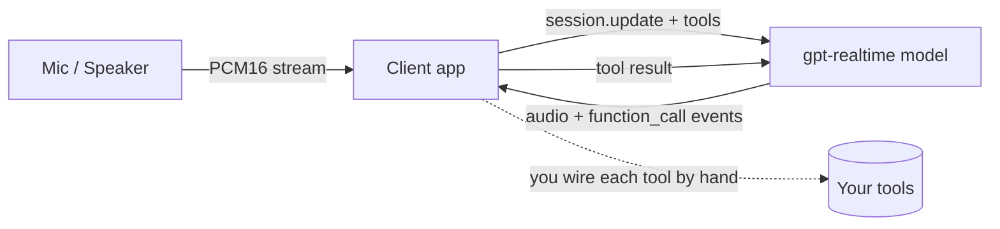
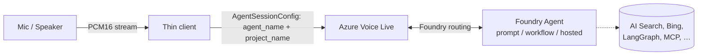
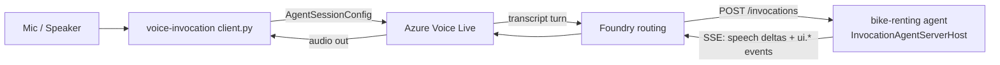
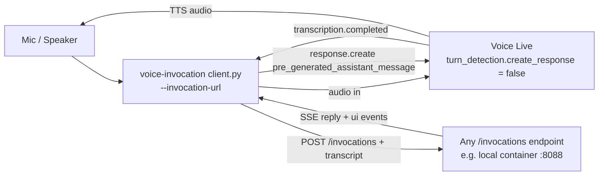
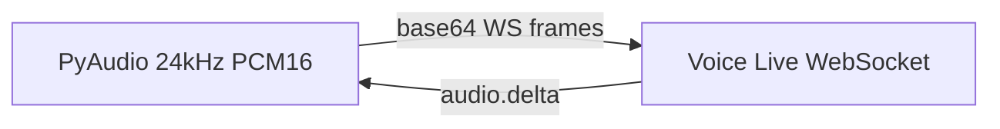
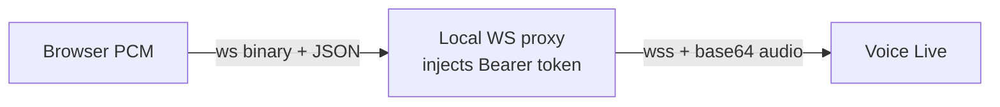
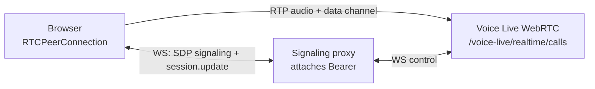
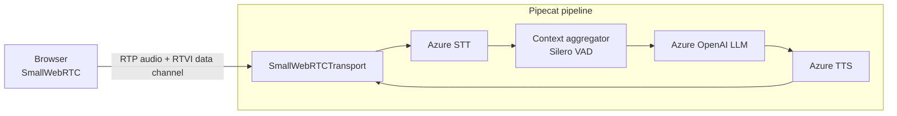
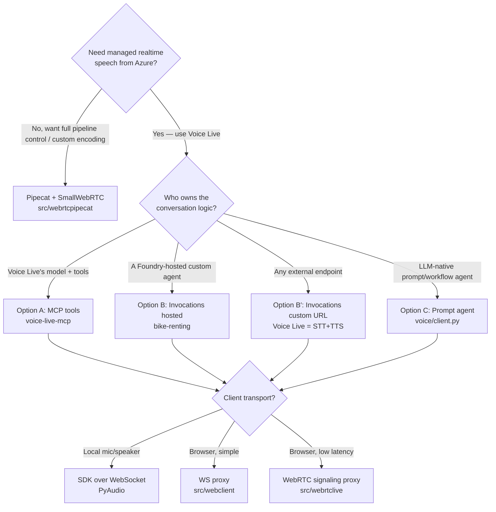

# Voice Agent Architecture — Protocol Options for Azure Voice Live

This document explains the **protocol options** for building a voice agent on
Azure, using the scenarios shipped in this repository. It contrasts a *plain
realtime‑model app* with a *Voice Live agent*, and then drills into the
different ways a Voice Live session can be wired to backend logic:

- **MCP** (Model Context Protocol) tool backends
- **Invocations API** custom agents (hosted in Foundry *or* a custom URL)
- **Responses / Prompt agents** bound directly to the Voice Live session
- **Pipecat** as a client‑side pipeline that changes the audio encoding
- **WebRTC** as the client transport for low‑latency browser audio

> The concrete code for every box below lives under [src/](../src). File
> references are linked throughout.

---

## 1. The two baselines: Realtime model vs. Voice Live agent

Both approaches expose a **single bidirectional streaming session** that does
speech‑in → reasoning → speech‑out. The difference is *where the conversational
brain lives* and *who owns the turn loop*.

### 1a. Plain realtime‑model app (`gpt-realtime`)

The client talks to a single realtime model deployment. The model owns STT,
reasoning, tool calls and TTS. The app supplies the system prompt and tool
schemas on every session and must implement tool‑calling glue itself.



- The **session config**, **system prompt**, **voice**, and **tool schemas**
  are all client responsibilities.
- Function calls come back as events; the client executes them and feeds
  results back into the same socket.

### 1b. Voice Live bound to a Foundry agent

Voice Live is a managed realtime gateway. Instead of pointing it at a raw
model, you bind the session to a **Foundry agent** via `AgentSessionConfig`
(`agent_name` + `project_name`). Now the *agent* — defined and versioned in
Foundry — owns the prompt, the voice, the tools and the routing. The client
shrinks to "stream audio in, play audio out".



Reference: [src/voice/client.py](../src/voice/client.py) binds Voice Live to
the `bike-concierge` **prompt agent** — the simplest "Voice Live ↔ Foundry
agent" reference.

**Why this matters:** with the agent binding, the client never sees the system
prompt or tool schemas. You can re‑deploy / re‑route the agent server‑side
without touching any client. The plain‑model app trades that governance for
full client‑side control.

---

## 2. Where the conversational logic lives — three integration protocols

Once Voice Live handles the audio, you have **three distinct protocol options**
for the backend that produces the actual answers. They differ in *who runs the
turn loop* and *what wire format the backend speaks*.

| Option | Backend protocol | Who drives the turn? | Voice Live role | Repo scenario |
|---|---|---|---|---|
| **A. MCP tools** | Model Context Protocol over Streamable‑HTTP | Voice Live's model | STT + LLM + TTS, calls MCP tools | [voice-live-mcp](../src/agents/voice-live-mcp/agent.py) |
| **B. Invocations (hosted)** | `/invocations` SSE, routed by Foundry | The hosted agent | STT + TTS + routing | [bike-renting](../src/agents/bike-renting/main.py) |
| **B′. Invocations (custom URL)** | `/invocations` SSE, called by the client | The client + your endpoint | STT + TTS only | [voice-invocation](../src/voice-invocation/client.py) |
| **C. Responses / Prompt agent** | Foundry agent (Responses API under the hood) | Voice Live's model via the agent | STT + LLM + TTS | [voice/client.py](../src/voice/client.py) |

### Option A — MCP tool backend

Voice Live keeps the reasoning loop (its own `gpt-realtime` model), but its
**tools are served by an MCP server**. You declare one or more `MCPServer`
entries in the session config; Voice Live discovers the tools, decides when to
call them, and invokes them over **Streamable‑HTTP MCP**.

```mermaid
flowchart LR
    subgraph Local
      mic[Mic / Speaker]
      agent[voice-live-mcp agent.py]
    end
    mic --> agent
    agent -->|session.update with MCPServer{server_url}| vl[Azure Voice Live]
    vl -->|model reasoning| vl
    vl -->|MCP tool call over HTTPS| mcp[bike-rental MCP server\nStreamable-HTTP /mcp]
    mcp -->|tool result| vl
    vl -->|audio out| agent --> mic
```

Key points from [src/agents/voice-live-mcp/agent.py](../src/agents/voice-live-mcp/agent.py):

- The session is configured with `MCPServer(server_label, server_url,
  allowed_tools=[…])`. Tool execution happens **server‑side in Voice Live →
  MCP**; the client never sees individual tool calls.
- `require_approval` ("never" / "always") controls human‑in‑the‑loop approval
  for MCP calls (handled via `MCPApprovalResponseRequestItem`).
- Requires Voice Live **API version `2026-04-10`** for MCP support.
- Because Voice Live runs in the cloud, the MCP server must be **publicly
  reachable** — locally you expose it with a devtunnel/ngrok. The MCP server
  itself ([src/mcp-server-bike-rental/server.py](../src/mcp-server-bike-rental/server.py))
  exposes `search_bikes`, `reserve_bike`, `confirm_booking`, … as MCP tools
  with a server‑side reservation ledger.

**Use when:** you want Voice Live's model to stay in charge of reasoning, and
you only need to give it *capabilities* (tools), not a different brain. MCP is
the cleanest contract for reusable, framework‑agnostic tools.

### Option B — Invocations API (hosted agent)

Here the **backend agent owns the turn**. The agent is a hosted Foundry agent
built on `azure-ai-agentserver-invocations`. Voice Live binds to it with
`AgentSessionConfig`; Foundry routes every turn to the agent's `/invocations`
endpoint, which streams back an **SSE** response. Voice Live speaks the result.



The invocations contract (see [src/agents/bike-renting/main.py](../src/agents/bike-renting/main.py)):

- **Input** to the agent is typed JSON. Voice Live sends
  `{"type": "input_audio.transcription", "input": "..."}` for speech; UI/click
  events arrive as arbitrary JSON on the same endpoint — this is the
  **multi‑modal "voice + click"** pattern.
- **Output** is an SSE stream of:
  - `output_audio_transcription.delta` / `.done` — the text Voice Live should
    speak (TTS),
  - **custom typed events** (e.g. `ui.bike_cards`, `ui.reservation_confirmed`)
    passed straight through to the client to render as cards,
  - `done` — end of turn.
- The agent keeps its own **conversation state machine**
  (`idle → results_shown → bike_selected → reserved → booked`) keyed by
  `agent_session_id`.
- The manifest ([agent.manifest.yaml](../src/agents/bike-renting/agent.manifest.yaml))
  declares `protocol: invocations` and `voiceLiveCompatible: "true"`.

**Use when:** the backend needs full control of the dialog (custom state
machine, deterministic flows, structured UI events) but you still want Voice
Live to do all speech and Foundry to do the routing/hosting.

### Option B′ — Invocations API (custom URL, Voice Live as STT+TTS only)

Same `/invocations` contract, but **Foundry is out of the loop**. Voice Live is
degraded to a pure speech pipeline and the *client* orchestrates the turn:



From [src/voice-invocation/client.py](../src/voice-invocation/client.py):

- Voice Live is configured with **`create_response = false`** (using
  `AzureSemanticVad` + the `azure-speech` transcription model), so it never
  invents a reply.
- On `CONVERSATION_ITEM_INPUT_AUDIO_TRANSCRIPTION_COMPLETED`, the client POSTs
  the transcript to the custom URL, reads the SSE, then injects the reply back
  with `ResponseCreateParams(pre_generated_assistant_message=…)` so Voice Live
  simply **TTS‑es the supplied text verbatim**.

**Use when:** the conversational backend is anything at all (a local container,
a non‑Foundry service) and you only want Azure for high‑quality STT/TTS and
barge‑in. This is the most decoupled option — the trade‑off is the client now
owns turn orchestration and latency.

### Option C — Responses / Prompt agent (model‑driven)

The Foundry agent is a **prompt agent** (or workflow) that runs on the
Responses API under the hood. Voice Live binds to it exactly like Option B, but
the agent is *model‑reasoning‑driven* rather than a hand‑written state machine.
This is the [src/voice/client.py](../src/voice/client.py) path binding to
`bike-concierge`, which can itself route to specialist agents (product‑guide,
support‑hotline, repair‑status) via the `bike-support` workflow.

**Use when:** you want LLM‑native reasoning/routing with the least custom code,
and you're happy for the model (governed by the Foundry agent definition) to
drive the dialog.

---

## 3. Client transport options

The integration protocol (§2) is independent from **how audio reaches Voice
Live from the user**. There are three transport patterns in the repo.

### 3a. Direct SDK over WebSocket (PyAudio clients)

The local clients ([src/voice](../src/voice),
[src/voice-invocation](../src/voice-invocation),
[src/agents/voice-live-mcp](../src/agents/voice-live-mcp)) use the
`azure-ai-voicelive` SDK. Audio is **PCM16, 24 kHz, mono**, captured from
PyAudio in 50 ms chunks, base64‑encoded into `input_audio_buffer.append`, and
played back from `response.audio.delta` events. Barge‑in is handled by a
sequence‑numbered playback queue that is flushed on
`INPUT_AUDIO_BUFFER_SPEECH_STARTED`.



### 3b. Browser via WebSocket proxy (no WebRTC)

Browsers cannot set the `Authorization` header on a raw WebSocket, so a tiny
**local proxy** bridges the browser and Voice Live and injects the Entra token.

- [src/webclient/proxy.py](../src/webclient/proxy.py) serves `index.html` and
  translates the browser's `invocations_ws` protocol (binary PCM + simple JSON)
  to the Voice Live JSON‑with‑base64 protocol, attaching the bearer token from
  `az account get-access-token`.



**Use when:** you want a zero‑install browser demo and don't need WebRTC's
low‑latency media path.

### 3c. Browser via WebRTC (low‑latency media)

For production browser audio, the client opens a **WebRTC peer connection
directly to Voice Live**: audio rides RTP peer‑to‑peer, and non‑audio events
travel over a **WebRTC data channel**. The server is only a **signaling
proxy** — it relays the SDP offer/answer and the control WebSocket so the
`Authorization` header can be attached (browsers can't set it on raw sockets).



From [src/webrtclive/server.py](../src/webrtclive/server.py) and
[src/webrtclive/index.html](../src/webrtclive/index.html):

- The browser creates `RTCPeerConnection`, a `voice-live-events` data channel,
  adds the mic track, and sends an SDP offer wrapped as
  `{"type": "rtc.call.sdp.create", "sdp_offer": …}`. The server forwards it and
  relays `rtc.call.sdp.created` back.
- The session is bound to a Foundry agent via the same `AgentSessionConfig`
  query params (`agent_name`, `project_name`).

**Combining WebRTC + invocations:**
[src/webrtc-bike-rental/server.py](../src/webrtc-bike-rental/server.py) fuses
§3c with Option B′ — WebRTC carries STT/TTS (with `create_response = false`),
and each transcript is POSTed to the local `bike-renting` `/invocations`
endpoint; `ui.*` events render as cards in the page.

---

## 4. Pipecat — changing the encoding / pipeline on the client side

Everything above relies on the managed **Voice Live** realtime service. The
**Pipecat** scenario ([src/webrtcpipecat](../src/webrtcpipecat)) is a
fundamentally different topology: there is **no Voice Live**. Instead the client
runs a **Pipecat pipeline** that assembles discrete Azure Speech services and an
Azure OpenAI LLM into the realtime loop itself, with **SmallWebRTC** as the
transport.



Why this is the place where **encoding is controlled by the client**:

- The pipeline owns each stage explicitly —
  [src/webrtcpipecat/webrtc_server.py](../src/webrtcpipecat/webrtc_server.py)
  builds `AzureSTTService`, `AzureLLMService`, `AzureTTSService` and wires them
  with `SileroVADAnalyzer` for turn detection. You choose the sample rate,
  codecs, VAD strategy, and the STT/TTS voices yourself, rather than accepting
  Voice Live's managed PCM16/24 kHz contract.
- The transport is **SmallWebRTC**: the WebSocket is used **only as the
  signaling channel** (`offer`/`answer`/`ice_candidate`); once negotiated,
  audio flows over the peer connection and **RTVI** control messages travel on
  the WebRTC data channel (see the signaling protocol documented in
  [src/webrtcpipecat/server.py](../src/webrtcpipecat/server.py)).
- Because the pipeline is local, you can re‑encode/transform audio frames,
  insert custom processors, swap providers, and emit custom RTVI server
  messages (turn/latency metrics) — none of which is possible when the realtime
  loop is the managed Voice Live black box.

**Trade‑off:** maximum control and provider flexibility (and the ability to
change encoding/codecs/VAD per stage) at the cost of operating the full media
pipeline yourself, versus Voice Live's single managed endpoint.

---

## 5. Decision guide



### Summary of the protocol axes

1. **Realtime model vs. Voice Live agent** — raw model (client owns prompt +
   tools) vs. agent binding (`AgentSessionConfig`, server owns everything).
2. **Backend integration** — MCP tools (A), Invocations hosted (B), Invocations
   custom URL (B′), or Responses/Prompt agent (C). A and C keep Voice Live's
   model in the loop; B/B′ hand the turn to your agent and may reduce Voice Live
   to STT+TTS (`create_response = false`).
3. **Client transport** — SDK/WebSocket (PyAudio), browser WS proxy, or
   browser WebRTC (RTP + data channel, server only signals).
4. **Pipecat** — opt out of Voice Live entirely to own the STT→LLM→TTS pipeline
   and the audio encoding/codecs on the client, over SmallWebRTC + RTVI.
