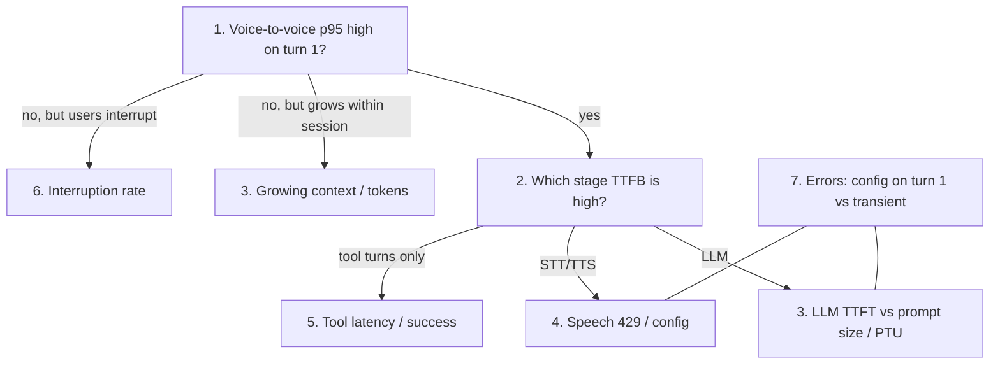

# Voice Bot Metrics — Diagnostic Signal Guide

For each of the **7 minimum metrics**, this file explains *how the metric turns
into a signal that something is wrong* — observable with **single or low-session,
normal usage** (no load test required). Every metric is read through two lenses:

- **🔁 Session lens** — what it says about **session behaviour** (turns, length, outcome).
- **🔎 Trend reading** — the **shape over time** that indicates a real issue vs. noise.

The pattern to internalize: *a single reading is rarely meaningful; the **trend**
over a session and across sessions is what exposes the root cause.*

---

## 1. Voice-to-voice latency (p95)

**Healthy:** flat p95 under ~800 ms, stable turn-to-turn.

- **🔁 Session lens:** Latency that is *already* high on the very first turn of a single session = a **code/config problem** (wrong region, non-streaming client, cold model), not scale. If latency **grows within a long session** (turn 1 fast, turn 20 slow) → growing context/token count (metric 3).
- **🔎 Trend reading:** A widening **gap between p50 and p95** means *some* turns are hurting while the median looks fine — classic sign of intermittent contention or a slow tool/turn. A rising **p95/p50 ratio** is the earliest warning.

---

## 2. Per-service TTFB — STT / LLM / TTS (split)

**Healthy:** each stage stable within its budget; sum ≈ metric 1.

- **🔁 Session lens:** LLM TTFB creeping up **turn-over-turn within a session** = growing context window. STT TTFB tied to utterance length = audio buffering / VAD. A single stage that is high from turn 1 pinpoints the misconfigured service.
- **🔎 Trend reading:** This is the **triage metric** — the stage whose TTFB trend diverges from the others *is* the bottleneck. If all three move in lockstep, suspect the shared path (audio transport / network to the services), not any single service.

---

## 3. LLM time-to-first-token vs. PTU utilization / 429s

**Healthy:** TTFT flat; PTU utilization well within budget; near-zero 429s.

- **🔁 Session lens:** Long prompts / unbounded history push tokens up, which raises TTFT *and* utilization even within a single session — distinguishes "prompt bloat / growing context" from a healthy short-turn conversation. Watch tokens-per-turn climb as the session goes on.
- **🔎 Trend reading:** Plot **TTFT and PTU% together** — if TTFT rises while PTU% stays low, the cause is prompt size or the network, not capacity. Any 429 at all during normal usage means the deployment quota is already too tight for even light traffic.

---

## 4. Speech 429 / throttled calls (STT + TTS)

**Healthy:** essentially zero.

- **🔁 Session lens:** A throttled STT/TTS call mid-session = **dropped or stuttering audio** for that user. Even one 429 during light usage is a red flag that the resource tier / concurrent-connection limit is set too low.
- **🔎 Trend reading:** Any **non-zero, rising** 429 trend = provision more Speech capacity / raise the tier *before* it becomes user-visible. It's a leading indicator that precedes latency degradation.

---

## 5. Tool / function-call latency & success rate

**Healthy:** low, bounded latency; high success; single tool-loop round.

- **🔁 Session lens:** Turns that invoke tools being much slower than turns that don't isolates the tool path as the latency source within a session. Multiple tool-loop rounds per turn multiply voice-to-voice latency. A tool call with no timeout that hangs = the **whole conversation freezes** (dead air) — reproducible in a single call.
- **🔎 Trend reading:** Falling **success rate** or a rising **p95 tool latency** trend is a direct clue that a backend dependency — not the voice stack — is the problem. Watch tool-loop round count creeping above 1.

---

## 6. Interruption (barge-in) rate

**Healthy:** low, stable rate consistent with natural conversation.

- **🔁 Session lens:** High interruptions concentrated in specific sessions/turns = **over-long responses** (violating the "2–3 sentences" prompt rule) or mis-tuned VAD. Verify TTS actually cancels on barge-in (flush latency); if interruptions spike but TTS keeps playing → the cancel path is broken in code (frames not flushed). All reproducible in a single conversation.
- **🔎 Trend reading:** A rising interruption trend is an **early UX-degradation signal** that often precedes complaints — and frequently correlates with a latency regression (metric 1) as the underlying cause.

---

## 7. Error rate + retry rate (STT / LLM / TTS)

**Healthy:** low error rate; retries near zero.

- **🔁 Session lens:** Errors clustered at session start = auth/config (bad key, region, unsupported voice/SSML) — these reproduce on every single session regardless of load. Errors mid-session = transient faults or throttling. A steady **4xx** floor = a config bug constant across all sessions.
- **🔎 Trend reading:** Separate **4xx (config, present even at one session)** from **5xx/429 (capacity/transient)** — the shape tells you whether to fix code/config now or watch capacity. A rising retry rate is an early cascade warning.

---

## How to read them together (the diagnostic flow)

**Golden rules for troubleshooting with normal, low-session usage:**
1. **Turn 1 vs. later turns.** High on turn 1 = code/config (fix now). Grows over the session = context/token growth (metric 3).
2. **Split the total first.** Break voice-to-voice latency (metric 1) into per-stage TTFB (metric 2) — it names the culprit stage in one step.
3. **Within-session drift** is your main lever without load testing: latency and tokens rising over a single long call point to a specific growth bug.
4. **p95/p50 gap widening** before the median moves = intermittent slow turns (often a tool), caught early.
5. **4xx = config (present even at one session); 5xx/429 = capacity/transient (watch, don't necessarily fix in code).**
