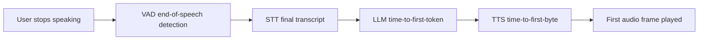

# Observability for a Pipecat Voice Bot on AKS with Foundry-hosted Models

This guide is a **metrics-and-behaviours checklist for an architecture and code
review** of a real-time voice bot built on Pipecat (cascade STT → LLM → TTS),
where the **models are hosted in Azure AI Foundry** and the **app runs in AKS**.

It maps the signals that native Azure services emit, calls out the gaps that
require **custom instrumentation**, and frames every metric around a concrete
question: *what bottleneck, scalability limit, session-handling bug, or latency
regression does this signal expose?*

The reference app is the Pipecat cascade bot in
[src/pipecat-voice-azure/bot.py](../src/pipecat-voice-azure/bot.py):

```
WebRTC (mic) → Azure Speech STT → Azure OpenAI (Foundry) LLM → Azure Speech TTS → WebRTC (speaker)
```

---

## 0. The one number that matters: conversational latency budget

For voice, the user-perceived quality metric is **voice-to-voice latency** — the
gap between the user finishing speaking and the bot starting to speak. Target is
typically **< 800 ms**, acceptable up to ~1.5 s. Everything below rolls up into
this budget:



| Segment | Owner | Typical budget | Where measured |
|---|---|---|---|
| VAD end-of-turn | Pipecat (Silero VAD) | 100–300 ms | App / custom |
| STT finalization | Azure Speech | 100–300 ms | App / Speech metrics |
| LLM time-to-first-token (TTFT) | Foundry / AOAI | 200–600 ms | App / AOAI metrics |
| TTS time-to-first-byte (TTFB) | Azure Speech | 100–300 ms | App / custom |
| Network / WebRTC jitter | AKS ingress + client | 20–150 ms | AKS / custom |

**The core review principle:** each hop's latency, error rate, and concurrency
must be observable *independently*, because a single "the bot feels slow"
symptom can originate in any of the five segments. Pipecat emits per-service
metrics (TTFB and processing time) via `enable_metrics=True` — this is your
primary lever and it is already turned on in the reference bot.

---

## 1. Pipecat application metrics (the most important layer)

The bot already sets `enable_metrics=True` and `enable_usage_metrics=True` in
`PipelineParams`. This makes Pipecat emit **`MetricsFrame`** objects containing
per-processor timing. These are the highest-signal metrics for a voice pipeline
and they are **not** available from any native Azure service — you must export
them yourself (see §7).

### 1a. Metrics Pipecat emits natively

| Metric | Meaning | What it reveals |
|---|---|---|
| **TTFB per service** (`ttfb`) | Time-to-first-byte for STT, LLM, TTS individually | Which stage owns the latency; the single most valuable voice metric |
| **Processing time per service** | Wall-clock a frame spends in each processor | Slow processors, CPU starvation, GIL contention |
| **LLM usage tokens** (`LLMUsageMetrics`) | Prompt/completion tokens per turn | Cost, prompt bloat, context-window growth over a session |
| **TTS characters** (`TTSUsageMetrics`) | Characters synthesized | TTS cost, over-long responses hurting latency |

### 1b. Behaviours to instrument in code (custom)

These require adding counters/spans in the pipeline; they are the ones that
expose *code and configuration* problems in a review:

- **End-of-turn / VAD timing** — how long after the user stops does the pipeline
  emit `UserStoppedSpeakingFrame`? Aggressive VAD → interruptions; lax VAD →
  dead air. Instrument the gap between `UserStoppedSpeaking` and STT final.
- **Interruption (barge-in) rate & handling** — count `StartInterruptionFrame`
  events. High rates signal the bot talks too long, or VAD is mis-tuned. Verify
  TTS actually cancels on interruption (frame flush latency).
- **Turn count and turn duration** per session — long turns hint at prompt or
  tool-loop problems.
- **Tool/function-call latency** — wrap each tool call in a span with name,
  duration, success/failure. This is invisible to Azure otherwise (see §5).
- **Context growth** — messages and token count in `LLMContext` over the
  session; unbounded growth is a classic memory + latency + cost bug.
- **Pipeline queue depth / frame backlog** — if a processor can't keep up,
  frames queue. Rising backlog = CPU-bound stage or blocking I/O on the event
  loop.
- **`idle_timeout_secs` fires** — count sessions ending on idle timeout vs.
  clean disconnect; distinguishes abandonment from graceful hangup.
- **Reconnect / renegotiation events** on the WebRTC transport.

---

## 2. Azure AI Foundry / Azure OpenAI (the LLM) — native observability

The LLM deployment lives in Foundry (Azure OpenAI under the hood). Native
signals come from **Azure Monitor platform metrics**, **diagnostic logs**, and
the **Foundry portal**.

### 2a. Platform metrics (Azure Monitor → the AOAI/Foundry resource)

| Metric | What it reveals | Review question |
|---|---|---|
| **Processed Prompt Tokens / Generated Tokens** | Throughput and cost | Are prompts bloated? Is context unbounded? |
| **Azure OpenAI Requests** | Call volume, split by status code | Retry storms, 4xx config errors |
| **Time to Response / Time to First Byte** (where exposed) | Server-side LLM latency | Is the LLM the bottleneck vs. the network? |
| **Provisioned-managed Utilization %** (PTU) | % of provisioned capacity used | Are you saturating PTU → queueing/throttling? |
| **429 / RateLimit responses** | Throttling | Under-provisioned deployment or missing backoff |
| **Tokens per minute (TPM) / Requests per minute (RPM) consumed vs. quota** | Quota headroom | Will you throttle at peak concurrency? |

### 2b. Diagnostic logs (send to Log Analytics)

Enable **Diagnostic Settings** on the Foundry/AOAI resource → route
`RequestResponse`, `Audit`, and `Trace` categories to a **Log Analytics
workspace**. This gives per-request rows: model, deployment, latency, token
counts, status, caller identity.

### 2c. Foundry-specific observability

- **Foundry Observability / tracing** — Foundry integrates OpenTelemetry GenAI
  semantic conventions; enable tracing on the project to capture model spans
  (input/output, token usage, latency) into Application Insights.
- **Model deployment throttling & capacity** — check whether the deployment is
  **Standard (shared)** vs. **Provisioned (PTU)**. Standard gives variable
  latency under load; PTU gives predictable latency but a hard ceiling. This is
  a key **architecture-review** finding for a latency-sensitive voice app.
- **Content-filter / safety-system latency** — the content filter adds latency
  and can block; watch for `content_filter` finish reasons.

### 2d. Bottleneck signals to look for

- Rising **TTFT** correlated with **PTU Utilization > ~80%** → capacity limit.
- **429s** climbing with concurrency → deployment quota too low; add exponential
  backoff and/or a second deployment for load spreading.
- **Generated-tokens** per turn trending up → responses too long for voice
  (they should be 2–3 sentences per the system prompt); hurts TTS TTFB too.

---

## 3. Azure AI Speech (STT + TTS) — native observability

Azure Speech (used for both STT and TTS in the reference bot) exposes metrics
via Azure Monitor on the Speech/Cognitive Services resource.

### 3a. Platform metrics

| Metric | Applies to | Review question |
|---|---|---|
| **Total Calls / Successful Calls** | STT + TTS | Volume, success ratio |
| **Total Errors / Blocked Calls / Server Errors / Client Errors (4xx)** | STT + TTS | Auth/config errors vs. transient faults |
| **Throttled Calls (429)** | STT + TTS | Concurrency limit hit → need higher tier/region capacity |
| **Latency** | STT + TTS | Server-side processing time (not end-to-end) |
| **Audio Seconds Transcribed** | STT | Usage/cost, session length |
| **Synthesized Characters** | TTS | Usage/cost, over-long responses |

### 3b. Diagnostic logs

Enable Diagnostic Settings → Log Analytics for `RequestResponse` and `Audit`.
For streaming STT/TTS the per-request latency is less meaningful than the
**app-side TTFB** (Pipecat), so treat Speech metrics as **health/error/throttle**
signals and rely on Pipecat for true first-byte latency.

### 3c. Signals to look for

- **429 Throttled Calls** on Speech under concurrency → the most common
  scalability wall for voice at scale; raises the question of per-region
  concurrent-connection limits and whether you need multiple regions/resources.
- **Client 4xx** spikes → bad SSML, unsupported voice, or key/region misconfig
  (a config-review item; note the bot reads `AZURE_SPEECH_REGION` and voice from
  env).
- Growing **Audio Seconds** per session with flat business value → sessions not
  closing (see §4 session handling).

---

## 4. AKS platform observability — scalability & session handling

This is where **scalability, resource, and session-lifecycle** problems show up.
Use **Azure Monitor managed Prometheus + Container Insights + Managed Grafana**,
and enable **Diagnostic Settings** on the cluster for control-plane logs.

### 4a. Pod / container metrics (Container Insights + Prometheus)

| Metric | Reveals | Review question |
|---|---|---|
| **CPU usage vs. limits/requests** | CPU saturation, throttling | Voice pipelines are CPU-bound (audio + VAD); is the pod throttled? |
| **CPU throttled seconds** (`container_cpu_cfs_throttled`) | Hitting CPU limit | Throttling → audio stutter, rising TTFB. Classic root cause. |
| **Memory working set vs. limit** | Leaks, OOMKills | Unbounded `LLMContext` or audio buffers → OOMKill mid-call |
| **OOMKilled / restart count** | Crash loops | Dropped calls; correlate restarts with dropped sessions |
| **Pod count vs. HPA target** | Autoscaling behaviour | Does HPA scale on the right signal (see §4c)? |

### 4b. Node & cluster metrics

- **Node CPU/memory pressure, allocatable vs. requested** — over-commit causes
  eviction of long-lived voice pods (very disruptive — a call drops).
- **Node pool scaling latency** — cluster-autoscaler add-node time; if a traffic
  spike needs new nodes, cold-start latency (image pull, pod ready) drops calls.
- **Network: pod egress bytes, connection counts, conntrack usage** — WebRTC +
  streaming to Speech/AOAI are long-lived connections; conntrack exhaustion or
  SNAT port exhaustion silently breaks new sessions.

### 4c. Session-handling & scaling design signals (review focus)

- **Concurrent active sessions per pod** — the true scaling unit for voice.
  **Custom metric** (§7): export a gauge of live pipelines. HPA on CPU alone is
  a **known anti-pattern** for voice — a pod can be CPU-idle yet hold max
  sessions, or CPU-saturated with few. **Scale on concurrent sessions**, not CPU.
- **SNAT port exhaustion** (outbound to Foundry/Speech) — a hard scalability wall
  for chatty egress; check Load Balancer outbound rules / NAT Gateway metrics.
- **Graceful shutdown / connection draining** — on scale-in or rollout, are
  active calls drained (`terminationGracePeriodSeconds`, `preStop`) or hard-
  killed? Hard kills = dropped calls during every deploy. High-signal review item.
- **Pod disruption budgets** — protect active-call pods during node maintenance.
- **Sticky routing** — WebRTC/websocket sessions are stateful; verify the
  ingress keeps a client on the same pod for the session lifetime.
- **Readiness vs. liveness** — a liveness probe that restarts a busy pod kills
  live calls; ensure probes account for long-lived sessions.

---

## 5. Tool / function-call latency (mostly custom)

The system prompt implies tool use (bike lookup, availability). Tool calls are a
frequent hidden latency source and are **invisible to Azure native metrics**
unless the tool itself is an instrumented Azure service.

Instrument in code:

- **Per-tool span**: name, arguments (redacted), duration, success/error, retry
  count. Emit as an OpenTelemetry span so it nests under the turn.
- **LLM tool-loop rounds** — how many model round-trips before a final answer;
  multi-round tool loops multiply voice-to-voice latency.
- **Downstream dependency latency** — if a tool calls MCP, a DB, Bing, or AI
  Search, propagate trace context (`traceparent`) so the flame graph spans the
  whole path. For MCP backends, instrument the MCP server request handler too.
- **Timeout / fallback behaviour** — does a slow tool block the turn or degrade
  gracefully? A missing timeout on a tool call freezes the whole conversation.

---

## 6. End-to-end distributed tracing (the glue)

Individual metrics answer "which layer is slow"; a **trace per conversation
turn** answers "why this specific turn was slow". Recommended model:

- **One trace per session**, **one span per turn**, child spans per stage
  (VAD → STT → LLM → tools → TTS). Attach: session id, turn index, latencies,
  token counts, interruption flag.
- Use **OpenTelemetry** with the **GenAI semantic conventions**; export to
  **Application Insights** (Azure Monitor OTLP). Foundry and AOAI already emit
  GenAI spans, so app spans + model spans stitch into one flame graph.
- Propagate **W3C `traceparent`** from the app into every downstream HTTP call
  (Foundry, Speech, MCP tools) to get a single end-to-end trace.

This is the highest-leverage addition a review can recommend: it turns "the bot
feels laggy sometimes" into a per-turn waterfall that points at the exact stage.

---

## 7. What is NOT natively covered — custom instrumentation checklist

Native Azure metrics stop at the service boundary. These voice-specific,
app-level signals **must be added** and are usually the ones that matter most:

| Signal | Why native metrics miss it | How to add |
|---|---|---|
| **Voice-to-voice latency** (end-to-end) | Spans multiple services + client | Timestamp `UserStoppedSpeaking` → first TTS audio frame; emit histogram |
| **Per-service TTFB** (STT/LLM/TTS) | Only the app sees frame boundaries | Export Pipecat `MetricsFrame` to OTel/Prometheus |
| **Concurrent sessions per pod** | K8s/Azure see CPU, not calls | Gauge incremented on connect / decremented on disconnect; scale HPA on it |
| **Interruption / barge-in rate** | Pipeline-internal event | Count `StartInterruptionFrame` |
| **VAD end-of-turn timing** | Client/VAD-internal | Instrument VAD → STT-final gap |
| **Tool-call latency & success** | Only app knows tool boundaries | Wrap tool calls in spans (§5) |
| **Context/token growth per session** | Only app holds `LLMContext` | Emit token/message-count gauge per turn |
| **Session outcome** (completed / abandoned / errored) | No single service owns it | Emit a session-end event with reason code |
| **Audio quality** (packet loss, jitter, MOS) | WebRTC-internal | Collect `getStats()` from the browser or transport RTP stats |
| **Cost per session** | Split across 3 services | Aggregate token + character + audio-second usage per session id |

**Recommended export path:** Pipecat metrics + custom counters →
**OpenTelemetry SDK** → **Azure Monitor OTLP exporter** → Application Insights &
managed Prometheus. Add a Grafana dashboard with the latency budget breakdown
(§0) as the top panel.

---

## 8. Review checklist — questions to answer with the signals above

**Latency / performance**
- [ ] Can you see per-turn TTFB for STT, LLM, and TTS *separately*?
- [ ] Is p50/p95 voice-to-voice latency tracked, with a target SLO?
- [ ] Is LLM TTFT correlated with PTU utilization / 429s?
- [ ] Are responses short (2–3 sentences) so TTS TTFB stays low?

**Scalability**
- [ ] Does HPA scale on **concurrent sessions**, not CPU?
- [ ] Any Speech/AOAI **429 throttling** at peak? Quota headroom known?
- [ ] SNAT / conntrack / outbound port exhaustion checked for egress-heavy pods?
- [ ] Node-pool scale-out latency measured against traffic spike shape?

**Session handling**
- [ ] Are calls **drained** on deploy/scale-in (no hard kills)?
- [ ] Is client↔pod affinity guaranteed for the session lifetime?
- [ ] Do liveness probes avoid restarting pods with live calls?
- [ ] Are idle timeouts vs. graceful disconnects distinguished in metrics?

**Tool calls**
- [ ] Is every tool call a span with duration + success + retries?
- [ ] Do tools have timeouts and graceful fallbacks (no turn-freezing)?
- [ ] Is the tool-loop round count bounded and observed?

**Code / config**
- [ ] Is `LLMContext` bounded (no unbounded token/memory growth)?
- [ ] Is VAD tuned (interruption rate vs. dead-air measured)?
- [ ] Are STT/LLM/TTS clients configured for streaming (not batch)?
- [ ] Is retry/backoff present on Foundry and Speech calls?

**Observability foundation**
- [ ] Diagnostic Settings → Log Analytics on Foundry, Speech, and AKS?
- [ ] Managed Prometheus + Container Insights + Grafana enabled on AKS?
- [ ] One trace per turn stitched across app + model spans in App Insights?
- [ ] Cost-per-session aggregated across the three services?

---

## 9. Native-vs-custom summary

| Layer | Native coverage | Gap to fill with custom instrumentation |
|---|---|---|
| **Foundry / AOAI (LLM)** | Tokens, requests, 429, PTU util, latency, GenAI traces | Per-turn attribution, tool-loop rounds |
| **Azure Speech (STT/TTS)** | Calls, errors, throttling, latency, usage | True streaming TTFB, per-turn correlation |
| **AKS** | CPU/mem, restarts, node/network, control-plane logs | Concurrent-session gauge, call-aware scaling & draining |
| **Pipecat app** | TTFB & usage via `MetricsFrame` (must be exported) | Everything voice-specific: v2v latency, interruptions, VAD, sessions |
| **WebRTC transport** | — (nothing native in Azure) | Packet loss, jitter, MOS from client `getStats()` |
| **Tools / MCP** | Only if the tool is an instrumented Azure service | Per-tool spans, downstream trace propagation |
